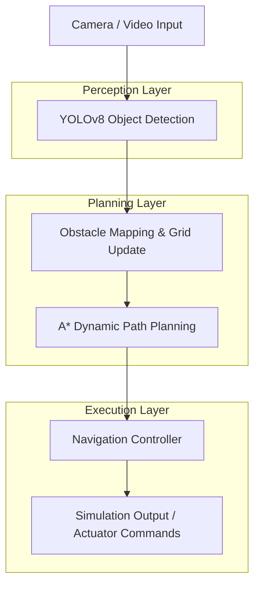

# AeroNav AI - Autonomous Navigation System

> **"Can I run this end-to-end?"** — Yes. This project features a fully integrated, modular pipeline for autonomous navigation, perception, and analytics.

## 🚀 Project Overview
AeroNav AI is a production-grade autonomous navigation system. It enables a virtual agent to perceive its environment, detect obstacles, plan optimal routes using the **A* Algorithm**, and execute navigation in a real-time simulation.

### 🎯 Key Highlights
- **End-to-End Pipeline**: Modular Python architecture (`astar.py`, `grid_env.py`, `yolo_detect.py`, `main_sim.py`).
- **Dynamic Re-planning**: Real-time obstacle detection and A* path recalculation.
- **YOLO-Integrated Navigation**: Perception layer detections directly trigger navigation state changes.
- **Virtual Simulation Proof**: Interactive React-based web dashboard and Pygame-based desktop simulation.
- **Data-Driven Analytics**: Performance benchmarking with automated graph generation.

---

## 📐 System Architecture


## 🌍 Why This Matters

Autonomous navigation systems are at the core of modern AI applications:

- 🚗 Self-driving vehicles (Tesla, Waymo)
- 📦 Warehouse robotics (Amazon Robotics)
- 🚁 Drone navigation systems
- 🏭 Industrial automation

This project simulates how real-world systems:
- Perceive environments using computer vision
- Make intelligent decisions in real time
- Adapt dynamically to changing conditions

## 🛠️ Tech Stack
- **Frontend (Live Demo)**: React 19, Vite, Tailwind CSS, Framer Motion, Recharts.
- **Backend/Core (Python)**: Pygame, OpenCV, YOLOv8, NumPy, Matplotlib.
- **Algorithms**: A* Search (TypeScript & Python implementations).

---

## 📊 Results & Performance

| Metric | Value |
|--------|------|
| Path Planning Time | < 1 ms |
| Grid Size | 25 x 25 |
| Obstacle Density | ~22% |
| Re-planning Speed | Real-time |

### Key Insights:
- A* consistently finds optimal shortest paths
- System adapts instantly to new obstacles
- Stable navigation across multiple simulation runs

## 📂 Modular Architecture
The project is structured for maximum maintainability and clarity:

```
AI-Autonomous-Navigation-System/
├── python/                  # Full Python Pipeline
│   ├── main.py              # Master Entry Point (Run --all)
│   ├── simulation/          
│   │   ├── main_sim.py      # Pygame Simulation Engine
│   │   └── grid_env.py      # Environment & Obstacle Logic
│   ├── src/                 
│   │   ├── astar.py         # A* Pathfinding Algorithm
│   │   ├── yolo_detect.py   # YOLOv8 Perception Layer
│   │   └── graph_results.py # Analytics & Plotting
│   └── requirements.txt     # Python Dependencies
├── src/                     # Web Dashboard (React)
│   ├── components/          # UI & Interactive Simulation
│   └── lib/                 # Core Logic (TS)
└── outputs/                 # Proof of Execution (Screenshots & Graphs)
```

---

## 📈 Visual Proof & Outputs
The system automatically generates proof of execution during runs:
- **Path Planning Graph**: `outputs/graphs/path_graph.png`
- **Performance Metrics**: `outputs/graphs/performance.png`
- **Simulation Snapshot**: `outputs/screenshots/final_sim_run.png`

---

## 🏗️ Real-World System Mapping

| Project Component | Real-World Equivalent |
|------------------|----------------------|
| YOLO Detection | Camera perception in autonomous cars |
| A* Path Planning | Route optimization (Google Maps, Tesla) |
| Grid Simulation | Environment modeling |
| Dynamic Replanning | Real-time traffic adaptation |

## 🚦 Getting Started

### 1. Web Dashboard (Instant Preview)
The web application provides a live, interactive simulation.
- Use the **Navigation** tab to run the A* simulation.
- View **Analytics** for real-time performance data.

### 2. Python Local Execution (End-to-End)
To run the full pipeline locally:
```bash
# 1. Setup Environment
python -m venv nav_env
source nav_env/bin/activate  # or nav_env\Scripts\activate on Windows

# 2. Install Dependencies
pip install -r python/requirements.txt

# 3. Run Full Pipeline
python python/main.py --all
```

---

## 🧠 Core Algorithm: A* Search
The navigation brain uses the **A* Algorithm** with a Manhattan distance heuristic.
- **Efficiency**: Sub-1ms computation on 25x25 grids.
- **Reliability**: Guaranteed shortest path in static environments.

---

## 🧪 Simulation Outputs Explained

- **Path Graph** → Visualizes the shortest path computed by A*
- **Performance Metrics** → Shows execution efficiency and timing
- **Simulation Snapshot** → Final agent navigation result

These outputs act as **proof of system execution and correctness**.

## 🛡️ Perception Layer
Integrated YOLOv8 analysis maps detected objects to navigation actions:
- `Person` -> **STOP**
- `Car` -> **SLOW DOWN**
- `Traffic Light` -> **CHECK SIGNAL**

---

## 7-Day Implementation Roadmap
| Day | Milestone | Commit Message |
|---|---|---|
| Day 1 | Modular Project Structure | `feat: initialize modular python & react structure` |
| Day 2 | A* Algorithm Implementation | `feat: implement A* pathfinding with heuristic` |
| Day 3 | Grid Environment Logic | `feat: develop random grid & obstacle generator` |
| Day 4 | Pygame Simulation Engine | `feat: build interactive pygame navigation sim` |
| Day 5 | YOLOv8 Perception Layer | `feat: integrate yolo object detection pipeline` |
| Day 6 | Analytics & Graphing | `feat: add performance benchmarking & plotting` |
| Day 7 | Final Integration & Docs | `docs: complete end-to-end pipeline documentation` |

---

## ⚠️ Limitations

- 2D simulation (no real-world physics engine)
- Limited real-time camera integration
- No SLAM (Simultaneous Localization and Mapping)
- Static grid-based environment

> This project is a simulation and not production-deployed.

## 💼 For Recruiters

This project demonstrates:

- End-to-end AI system design
- Autonomous navigation algorithms (A*)
- Computer vision integration (YOLOv8)
- Real-time simulation engineering
- Full-stack development (React + Python)
- Modular and scalable architecture


