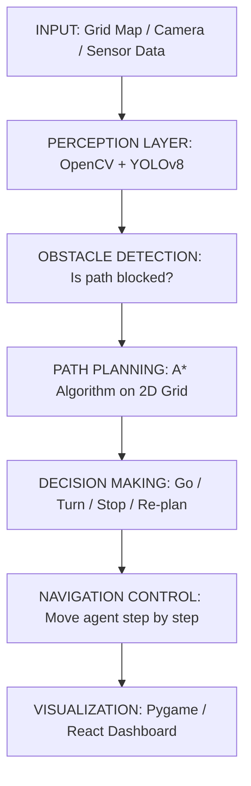

# AI-BASED AUTONOMOUS NAVIGATION SYSTEM
### Complete Project Guideline & Implementation Roadmap


---

## 1. Project Overview & Explanation
### What Is This Project?
An AI-Based Autonomous Navigation System enables a robot or virtual vehicle to travel from one point to another entirely on its own — no human driver needed. It uses computer vision to perceive the environment, detects obstacles, plans the safest route, and executes movement step by step.

### Simple Explanation
Think of a robot courier in a warehouse. Instead of a human guiding it, the robot:
- **Looks ahead** with its camera (Perception Layer)
- **Spots boxes**, walls, or people blocking the way (Obstacle Detection)
- **Calculates** the fastest safe route (A* Path Planning)
- **Moves** step-by-step along that route (Navigation Control)
- **Displays** the result on screen (Visualization)

### Complete System Workflow


---

## 2. Tech Stack
- **Option B (Selected)**: Python + Pygame + OpenCV + YOLOv8 + A*. 
- **Web Layer**: React 19, Vite, Tailwind CSS, Framer Motion, Recharts.

---

## 3. System Architecture
- **Input Module**: Handles grid generation and image input.
- **Perception Module**: Uses YOLOv8 to detect objects and classify threats.
- **Path Planning Module**: Implements A* algorithm with Manhattan distance.
- **Navigation Control**: Moves the agent step-by-step along the computed path.
- **Visualization Module**: Live grid, agent, path, and performance trail.

---

## 4. Folder Structure
```
AI-Autonomous-Navigation-System/
├── data/                    # Sample images/videos for YOLO testing
├── simulation/              # Pygame simulation engine (Python)
├── src/                     # Web Application Source (React)
│   ├── components/          # React components (Dashboard, Grid)
│   └── lib/                 # Core algorithms (A*, Grid logic)
├── python/                  # Python implementation source
│   ├── src/                 # A*, YOLO, Graphs modules
│   └── main.py              # Master entry point
├── outputs/                 # Screenshots, videos, and graphs
└── README.md                # Professional documentation
```

---

## 5. Environment Setup & Installation
### Step 1 — Install Python 3.10+
### Step 2 — Create Virtual Environment
```bash
python -m venv nav_env
source nav_env/bin/activate  # Mac/Linux
nav_env\Scripts\activate     # Windows
```
### Step 3 — Install Dependencies
```bash
pip install pygame opencv-python numpy matplotlib ultralytics
pip install jupyter notebook
```

---

## 6. Phase-by-Phase Implementation Plan
1. **Environment Setup**: Install Python, create venv, install libraries.
2. **Folder Structure**: Create GitHub-ready folder layout.
3. **A* Algorithm**: Write `astar.py`, test path finding.
4. **Grid Environment**: Write `grid_env.py` — random map with obstacles.
5. **Pygame Simulation**: Write `main_sim.py` — animated navigation.
6. **YOLO Detection**: Write `yolo_detect.py` — detect objects in images.
7. **Graphs Module**: Write `graph_results.py` — performance charts.
8. **Master Entry**: Write `main.py` with CLI arguments.
9. **Testing**: Run trials, verify path lengths + timing.
10. **GitHub Upload**: Init git, write README, push to GitHub.

---

## 7. Virtual Simulation Workflow
1. Activate virtual environment.
2. Run: `python python/main.py --sim`.
3. A 25x25 grid map generates randomly (~22% obstacle density).
4. A* algorithm computes the optimal path (displayed in YELLOW).
5. The agent begins moving along the path.
6. Purple trail marks cells already visited.
7. Screenshot auto-saved to `outputs/screenshots/`.

---

## 8. Resume / LinkedIn / Interview Guide
### Resume Bullet Points
- Built an AI-Based Autonomous Navigation System using Python, A* pathfinding, and YOLOv8; achieved sub-1ms computation time on a 2D grid.
- Developed a modular perception pipeline integrating YOLOv8 for object classification with navigation action mapping (STOP/SLOW/MONITOR).
- Designed a Pygame-based 2D simulation demonstrating the full autonomous agent lifecycle: perception, path planning, and obstacle avoidance.

### Interview Q&A
- **Q: What is A* and why did you use it?**
  - A: A* is an informed search algorithm that finds the shortest path using a heuristic. I chose it over Dijkstra because it explores fewer nodes by estimating distance to the goal.
- **Q: How does YOLO work?**
  - A: YOLO divides an image into a grid and predicts bounding boxes and class probabilities simultaneously in one forward pass.

---

## 9. Future Improvements
- **Diagonal Movement**: Allow 8-directional movement in A*.
- **Dynamic Obstacles**: Randomly add obstacles during simulation to test re-planning.
- **Lane Detection**: Use OpenCV Hough transforms for road lane detection.
- **ROS2 Integration**: Publish navigation commands as ROS2 topics for real robots.
- **CARLA 3D**: Replace Pygame with a full 3D autonomous driving environment.

---

## 10. Troubleshooting Guide
- **ModuleNotFoundError**: Ensure you have activated your virtual environment.
- **YOLO model not downloading**: Check your internet connection; it downloads on the first run.
- **No path found**: Lower the `obstacle_density` if the map is too crowded.
- **Pygame window doesn't open**: Ensure you are running on a machine with a display (not a headless SSH).

---

## 11. 7-Day Commit Plan
| Day | What To Build | Commit Message |
|---|---|---|
| Day 1 | Setup folders, venv, requirements.txt | feat: project structure and environment setup |
| Day 2 | Write astar.py, test in notebook | feat: implement A* pathfinding algorithm |
| Day 3 | Write grid_env.py + graph_results.py | feat: grid environment and visualization |
| Day 4 | Write main_sim.py (Pygame simulation) | feat: pygame 2D simulation with navigation |
| Day 5 | Write yolo_detect.py + test on image | feat: YOLOv8 perception layer |
| Day 6 | Wire everything in main.py, run --all | feat: integrate all modules in master pipeline |
| Day 7 | Write README, upload outputs, tag v1.0 | docs: complete README with architecture |

---

## License
MIT License

## Author
[Your Name]
[LinkedIn] | [GitHub]
